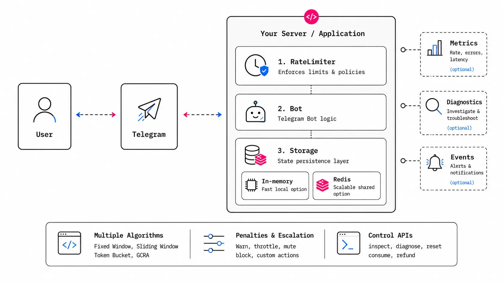

# Rate Limit Users (`ratelimiter`)

`ratelimiter` is a flexible telegram bot rate-limiting middleware for grammY bot framework.

<p align="center">
  <a href="https://github.com/grammyjs/ratelimiter">
    
  </a>
</p>

## Usage

See the [official grammY rate limiter documentation](https://grammy.dev/plugins/ratelimiter) for
installation and usage.

## Development

Deno is the source runtime; the npm package is generated for Node.js with `deno2node`. Keep public
APIs strongly typed, documented with JSDoc, and covered in both runtimes.

```sh
deno task ok
npm run typecheck
npm run lint
npm run test:node
```

Run `deno task test:redis` separately against a disposable Redis instance when changing Redis-backed
behavior.
